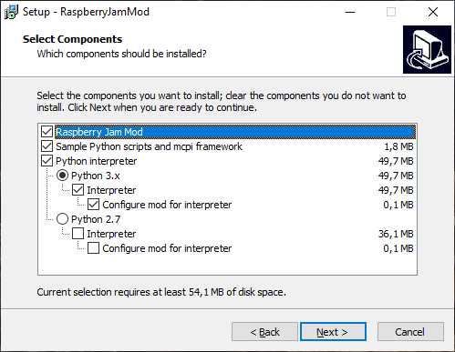
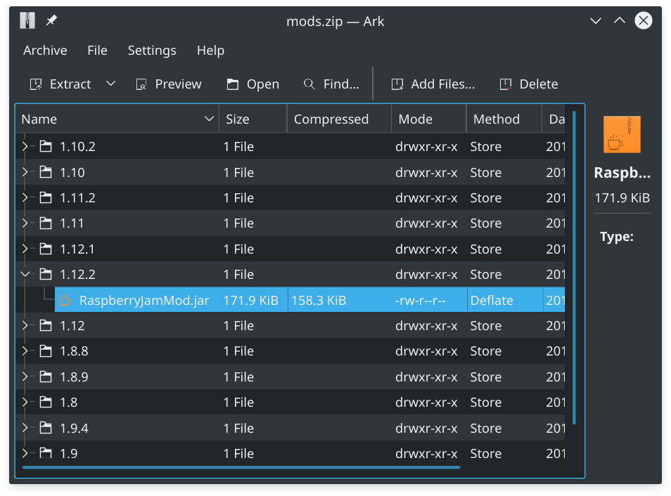
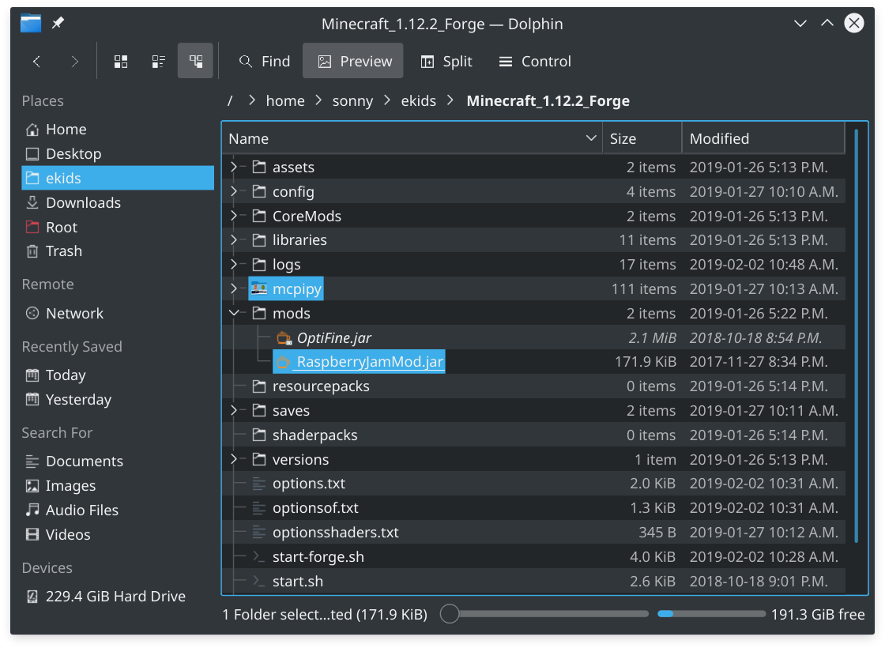
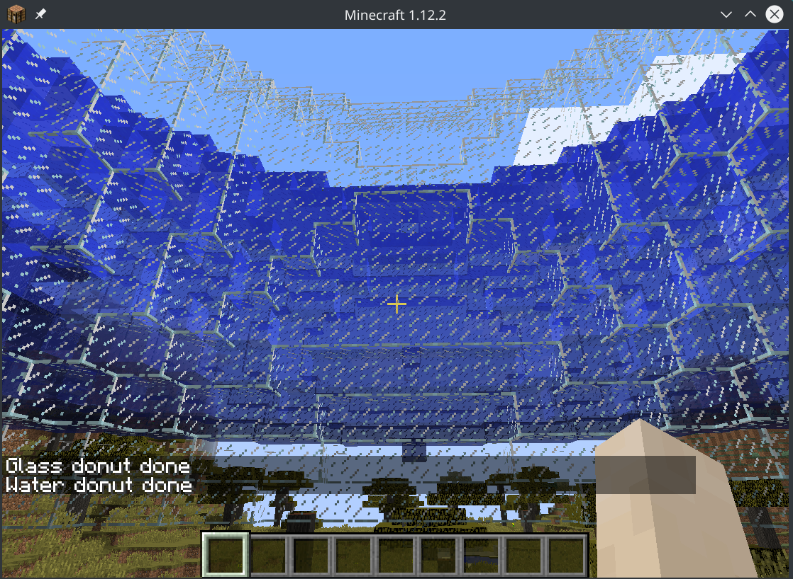

# Программирование на Python для Minecraft

## Что необходимо для работы

1. Скачать и установить Python 3. [Скачать можно тут.](https://www.python.org/downloads/)
2. Minecraft Java Edition версии от 1.8 до 1.12.2. [Купить можно здесь.](https://minecraft.net/en-us/)
3. Менеджер модов Forge для Minecraft. [Брать тут.](https://files.minecraftforge.net/)
4. Raspberry Jam Mod - мод добавляющий поддержку Python в игру. [Свежий релиз по ссылке.](https://github.com/arpruss/raspberryjammod/releases)

## Как это все настроить

### Установка Forge

1. Установить и запустить Minecraft. Создать новый профиль и мир. Запустить мир, проверить что игра работает. Выйти из игры.
2. [Скачать](https://files.minecraftforge.net/) и установить Forge для вашей версии игры. Настройки по умолчанию в установщике должны работать.
3. Запустить игру и убедиться что появился профиль Forge.

См. также [Как установить Minecraft Forge](https://ru.wikihow.com/%D1%83%D1%81%D1%82%D0%B0%D0%BD%D0%BE%D0%B2%D0%B8%D1%82%D1%8C-Minecraft-Forge) на WikiHow.

### Установка Raspberry Jam Mod

В репозитории мода на GitHub можно скачать последнюю [версию](https://github.com/arpruss/raspberryjammod/releases). Если у вас Windows, можете использовать автоматический установщик *RaspberryJamMod-Installer.exe*, который так же может установить набор необходимых скриптов и Python.

Инструкция по ручной установке:

1. Скачать архивы `mods.zip` и `python-scripts.zip`.
2. Из архива `mods.zip` выбрать файл с модом под вашу версию Minecraft и скопировать ее в папку `mods` в каталоге с игрой. Если такой папки нету - создайте. 
3. Содержимое архива `python-scripts.zip`распаковать в папку с игрой.

У вас должна получится примерна такая структура в папке с игрой:

### Как проверить что все работает

Запустить игру,в чате (открывается по нажатию `T`) ввести `/py donut` и нажать `Enter`.  Если вокруг персонажа начал рисовать «пончик» из кубиков стекла, поздравляем, вы сделали все правильно!

### Настройка IDLE

TODO
